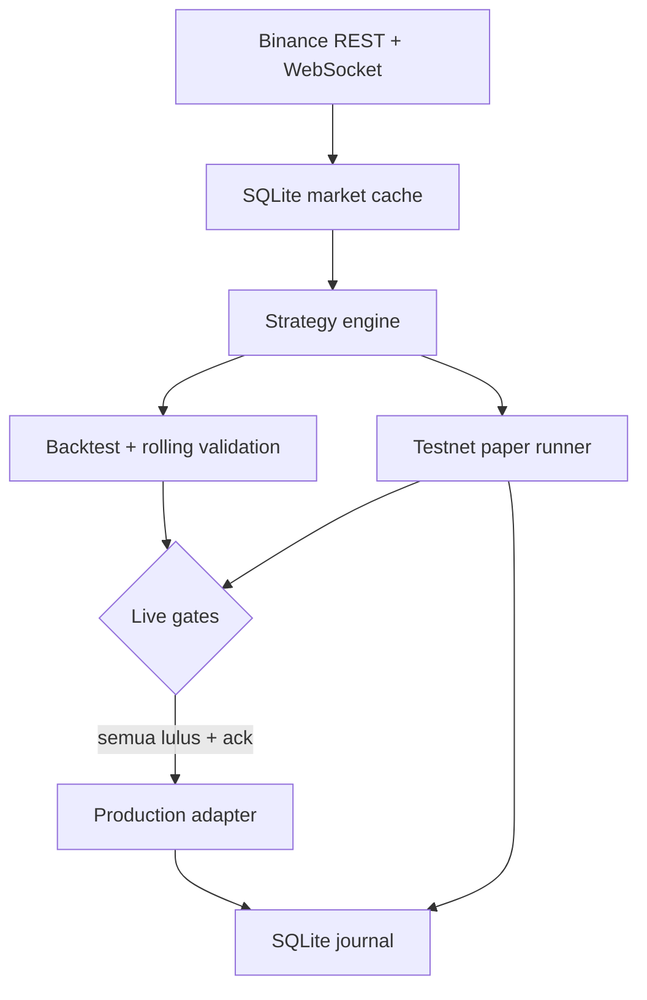

# Binance Spot Lab — modal dinamis (baseline 20 USDT)

**v0.5:** tersedia setup otomatis **GitHub Codespaces**, replay demo tanpa API key,
enam kandidat strategi termasuk pemisahan tren/range, serta seleksi dan stress biaya
pada tiga modal. Target riset WR 55% **belum tercapai**; kandidat baru belum membuktikan
perbaikan yang stabil. Lihat [cara membuka Codespaces](docs/CODESPACES.md) dan
[laporan v0.5](reports/evaluation-v0_5/README.md). Demo adalah simulasi historis;
paper Testnet dan live tetap memerlukan gate masing-masing.

**v0.4:** scanner banyak pair Spot/USDT, strategi tren/pullback, ATR sizing, dan evaluasi
OOS dengan saldo portofolio bersama sudah tersedia. Mulai dari
[`docs/MULTICOIN_RESEARCH.md`](docs/MULTICOIN_RESEARCH.md) dan
[`hasil pembanding delapan pair`](reports/evaluation-v0_4/README.md).
Laporan eksperimen baru belum meloloskan seleksi/gate; paper/live belum diaktifkan.
Pada snapshot delapan pair, adaptive mendapat WR 56,52% pada modal 20 USDT, tetapi
hanya 35,71% pada 1.000–10.000 USDT dengan return sekitar −5,8%. Perbedaan kelayakan
minimum order mengubah trade yang dieksekusi; hasil belum stabil lintas modal.

Bot riset trading **Binance Spot, long-only, tanpa leverage/futures**. Urutan yang dipaksa
oleh aplikasi adalah: data → backtest → validasi rolling-window → Binance Spot Testnet
minimal 14 hari → live. Lulus backtest **tidak** membuka live trading.

> **Disclaimer:** ini perangkat lunak eksperimen, bukan nasihat keuangan atau janji profit.
> Kehilangan seluruh modal tetap mungkin. Periksa aturan, pajak, dan ketersediaan Binance
> di yurisdiksi Anda.

## Status saat repository dibuat

| Tahap | Status |
| --- | --- |
| Struktur, cache SQLite, strategi modular | Selesai |
| Baseline backtest dengan fee + slippage | Selesai; lihat `reports/baseline/` |
| Binance Spot Testnet 14 hari / 20 trade | **Belum** |
| Live trading | **Diblokir oleh kode** |

Baseline yang disertakan adalah bukti eksekusi awal, bukan hasil yang dijanjikan. Pada
snapshot 24 bulan, modal 20 USDT berakhir 22,0207 USDT (+10,10%): 27 trade, win rate
48,15%, profit factor 1,708, max drawdown 6,05%, dan expectancy 0,07484 USDT/trade.
Enam dari delapan window tiga bulanan positif. Karena kandidat dipilih dari bounded sweep,
hasil ini mengandung selection bias dan **paper gate masih kosong**. `spotlab readiness`
adalah sumber status gate yang sebenarnya.

## Prinsip keselamatan

- Paper/live membaca saldo USDT akun secara dinamis; tidak ada hard cap 20 USDT.
- Maksimal satu posisi, risk budget 1% dan alokasi maksimal 50% dari equity akun.
- Untuk banyak pair, batas tersebut berlaku pada keseluruhan akun. Mode `all` dapat
  memindai setiap pair Spot/USDT yang lolos filter, tanpa memaksa order pada semua coin.
- Quantity juga dibatasi saldo `free`, buffer market order, `LOT_SIZE`, dan `NOTIONAL`
  Binance. Akun besar otomatis diskalakan atau dipotong ke batas exchange.
- Setiap buy langsung diikuti OCO stop-loss dan take-profit di exchange; preset baseline
  memakai jarak 2,5% dan 5%. Jika OCO gagal, bot mencoba menjual posisi market dan berhenti.
- Preset adaptive memakai stop berbasis ATR dan target reward/risk; intent yang hasilnya
  belum pasti, partial fill, atau OCO terputus memerlukan rekonsiliasi sebelum restart.
- Daily loss limit 3%, max drawdown 10%, state risiko persisten antar-restart.
- Kill-switch CLI tidak membatalkan OCO yang sedang melindungi posisi.
- Live memerlukan research gate, 14 hari runtime Testnet yang benar-benar tercatat,
  sedikitnya 20 trade tertutup, metrik paper minimum, serta acknowledgement eksplisit.
- Adapter live menolak API key yang memiliki izin withdrawal.

## Arsitektur



Strategy hanya menghasilkan sinyal; ia tidak tahu tentang API key atau order. Paper dan
live memakai state machine, risk manager, format jurnal, dan strategy engine yang sama,
tetapi broker adapter terpisah.

## Instalasi

Persyaratan: Python 3.11+ dan akun Binance Spot Testnet untuk tahap paper.

```bash
git clone https://github.com/pamungkasxd02-star/Trading-bot.git
cd Trading-bot
python3.11 -m venv .venv
source .venv/bin/activate
pip install -e '.[dev]'
cp .env.example .env
```

Windows PowerShell:

```powershell
py -3.11 -m venv .venv
.venv\Scripts\Activate.ps1
pip install -e ".[dev]"
Copy-Item .env.example .env
```

Isi `.env` hanya di komputer lokal. Untuk Testnet gunakan key Testnet; untuk production
buat key **trade-only tanpa withdrawal**. Jangan pernah menempelkan secret ke issue, log,
atau commit.

## 1. Ambil dan cache data

```bash
spotlab fetch --months 24
```

Perintah mengambil OHLCV melalui REST Binance, melakukan pagination, upsert idempoten ke
SQLite, dan menyimpan filter `LOT_SIZE`, `PRICE_FILTER`, serta `NOTIONAL` aktual. Backtest
berikutnya membaca cache lokal.

## 2. Backtest

```bash
spotlab backtest --months 24 --output reports/my-run
# Uji nominal lain tanpa mengubah config:
spotlab backtest --months 24 --initial-cash 10000 --output reports/10k
```

Nilai `backtest.initial_cash: 20` hanya preset untuk mereproduksi baseline. Ia dapat diganti
di YAML atau lewat `--initial-cash`; angka tersebut tidak membatasi paper/live.

Asumsi konservatif baseline:

- sinyal memakai candle yang sudah tutup; fill pada open candle berikutnya;
- fee 10 bps per sisi dan slippage 5 bps per sisi;
- bila stop dan target tersentuh pada candle yang sama, stop dianggap terjadi lebih dulu;
- quantity dibulatkan turun menurut `stepSize`, dan order di bawah min-notional dilewati;
- posisi terakhir ditutup paksa di akhir sampel.

Output: `summary.json`, `summary.csv`, `trades.csv`, `equity.csv`, dan
`equity_curve.png`.

## 3. Validasi rolling-window

Command `validate` berikut mempertahankan laporan format awal. Sejak v0.4, approval
execution memerlukan output `research` dengan fingerprint yang cocok; file baseline
lama hanya menjadi referensi historis.

```bash
spotlab validate --months 24 --initial-cash 10000 --window-months 3 \
  --output reports/validation-10k
```

Research pass memerlukan profit factor ≥1,05, expectancy positif, max drawdown ≤10%, dan
sekurangnya 75% rolling window positif. Tetap waspadai selection bias: parameter baseline
dipilih setelah membandingkan kandidat historis.

## 4. Paper trading Binance Spot Testnet

Pastikan kandidat terpilih pada training, laporan `research` berstatus `RESEARCH_PASS`
pada data terverifikasi, dan konfigurasi yang disalin cocok dengan laporan. Isi key
Testnet di `.env`, gunakan `exchange.testnet: true`, lalu:

```bash
spotlab --config config/validated.yaml fetch-universe
spotlab --config config/validated.yaml research-readiness
spotlab --config config/validated.yaml paper
```

Biarkan berjalan minimal 14 hari **runtime aktif**. Waktu offline atau heartbeat basi
tidak dihitung. Semua signal, order, session, posisi, trade, dan snapshot equity akun
disimpan di `data/runtime.db`; proses kedua untuk mode yang sama ditolak.

Testnet sering memiliki saldo virtual yang jauh lebih besar dari 20 USDT. Secara default
bot akan menyesuaikan sizing terhadap saldo itu. Untuk membatasi nominal demo secara
opsional, isi `risk.max_position_notional_usdt`; biarkan `null` agar tanpa hard cap.

Gunakan akun/sub-account khusus bot dan hindari order manual bersamaan. Deposit,
withdrawal, atau order lain yang mengunci USDT akan ikut mengubah equity akun dan dapat
memengaruhi perhitungan daily loss/drawdown.

```bash
spotlab --config config/validated.yaml readiness
spotlab --config config/validated.yaml export-trades --mode paper --output reports/paper-trades.csv
```

## 5. Menjalankan paper bot 24/7

Untuk mencoba di browser, gunakan [GitHub Codespaces](docs/CODESPACES.md). Setup otomatis
menjalankan replay historis enam bulan. Codespaces memiliki kuota dan timeout; untuk
paper 24/7 gunakan VM setelah validasi strategi selesai.

Repository menyertakan image non-root, Docker Compose dengan restart/health check, volume
SQLite persisten, rotasi log, live lock, serta bootstrap Ubuntu/Debian:

```bash
./scripts/server-bootstrap-ubuntu.sh
./scripts/server-start.sh
./scripts/server-status.sh
```

Panduan Oracle Always Free dan Google Free Tier, setup firewall, backup SQLite, update,
kill-switch, serta batasan layanan gratis ada di
[`docs/DEPLOY_FREE_24_7.md`](docs/DEPLOY_FREE_24_7.md). API key tetap hanya berada di
`.env` pada server, bukan di GitHub atau image.

## 6. Live — hanya setelah paper gate lulus

Modul multi-pair/adaptive v0.4 tetap dikunci dari live sambil menunggu bukti paper dan
peninjauan lanjutan. Petunjuk di bawah hanya untuk adapter single-pair lama setelah
seluruh gate konfigurasi tersebut lolos.

Salin config, ubah hanya config live yang sudah ditinjau, dan set
`exchange.testnet: false`. Jangan menggunakan key Testnet untuk production atau sebaliknya.

```bash
cp config/default.yaml config/live.yaml
# tinjau config/live.yaml dan ganti testnet menjadi false
spotlab --config config/live.yaml live --ack I_ACCEPT_REAL_MONEY_RISK
```

Perintah tetap gagal sebelum mengirim order jika research/paper gate belum lulus, kill
switch aktif, filter symbol belum ada, credential dapat withdraw, atau batas risiko
tercapai.

## Kill-switch

```bash
spotlab kill
spotlab clear-kill
```

`kill` menghentikan pengambilan posisi baru. OCO yang sudah berada di Binance dibiarkan
aktif. Sebelum `clear-kill`, periksa manual open orders dan balance di Binance.

## Strategi baseline

`rule_based_v1` memakai fresh EMA 20/56 bullish cross, harga di atas SMA 100, dan minimal
3 dari 4 konfirmasi: RSI 44–70, MACD bullish, close di antara middle/upper Bollinger Band,
dan volume ≥ SMA volume 20. Exit strategi memakai bearish EMA cross; SL/TP tetap wajib dan
ditangani execution layer.

Tambahkan strategi baru dengan mengimplementasikan `Strategy.prepare()` dan mendaftarkannya
di `spotlab.strategies.STRATEGIES`; core backtest/runtime tidak perlu diubah.

## Eksperimen ML (opsional, bukan sinyal live)

```bash
pip install -e '.[ml]'
spotlab ml-research --model logistic --output reports/ml
```

Modul memakai fitur berbasis data masa lalu dan `TimeSeriesSplit` dengan gap horizon.
Hasilnya sengaja tidak terhubung ke executor dan tidak dapat membuka live gate.

## Telegram (opsional)

Isi `TELEGRAM_BOT_TOKEN` dan `TELEGRAM_CHAT_ID`, lalu set
`runtime.telegram_enabled: true`. Notifikasi entry/exit dikirim dengan data yang sama dari
jurnal. Kegagalan notifikasi tidak boleh dijadikan alasan mengabaikan posisi di exchange.

## Pengembangan

```bash
ruff check .
ruff format --check .
pytest -W error::DeprecationWarning
```

Detail lebih lanjut: `docs/ARCHITECTURE.md`, `docs/METHODOLOGY.md`, dan `SECURITY.md`.
