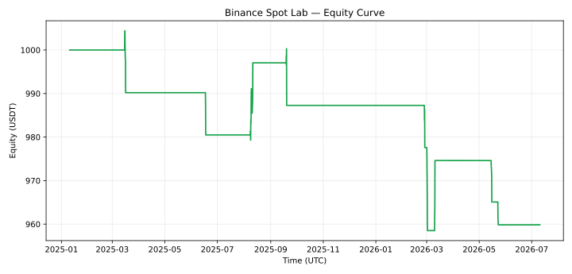

# Eksperimen filter kualitas — belum layak dipromosikan

**Tanggal eksekusi: 8 September 2026. Seleksi training: tidak ada kandidat. Semua
kandidat RESEARCH_FAIL.** Tidak ada order Binance/Testnet/live dalam eksperimen ini.
Preset demo aktif tidak diganti berdasarkan hasil berikut.

## Hipotesis dan protokol

Hipotesis: menyaring crossover baseline dengan kekuatan tren ADX, volume relatif,
kemiringan SMA, rentang ATR, serta batas candle lonjakan dapat mengurangi entry buruk.
Dua varian dibekukan sebelum batch: ADX ≥20 / volume ≥1,0× dan ADX ≥25 / volume ≥1,2×.
Filter lain, biaya, SL/TP fixed 2,5%/5%, dan risiko sama dengan pembanding baseline.
Tidak ada perubahan target profit untuk menaikkan WR secara kosmetik.

- Delapan pair: BTC, ETH, BNB, SOL, XRP, ADA, AVAX, LINK terhadap USDT; candle 4h.
- Data 10 Juli 2023 08:00–10 Juli 2026 08:00 UTC.
- Training 18 bulan, embargo satu candle, evaluasi enam window tiga bulan.
- Evaluasi 10 Januari 2025 12:00–10 Juli 2026 12:00 UTC (akhir eksklusif).
- Modal 20, 1.000, 10.000 USDT; satu saldo/posisi bersama, tanpa reset equity antar-window.
- Fee 10 bps dan slippage 5 bps per sisi; stress biaya 1,5× dan 2×.
- Target WR 55%, minimal 20 trade training / 30 trade evaluasi; gate risiko tetap berlaku.

[Protokol](protocol.json) dibuat sebelum menghitung hasil. Dataset dan SHA sumber ada
pada [manifest](manifest.json). Ini snapshot pihak ketiga yang sudah dipakai penelitian
sebelumnya; belum ada verifikasi data/filter historis langsung ke Binance. Periode ini
**bukan fresh holdout**. Angka berikut merupakan diagnostik eksploratif, bukan validasi
scalping satu menit atau persetujuan paper/live.

## Hasil evaluasi — 1.000 USDT

| Kandidat | Trade | WR | PF | Return net | Max DD | Expectancy USDT |
| --- | ---: | ---: | ---: | ---: | ---: | ---: |
| Baseline | 14 | 14,29% | 0,295 | −8,12% | 10,69% | −5,799 |
| Quality cross | 10 | 20,00% | 0,449 | −4,02% | 4,57% | −4,016 |
| Quality selective | 3 | 0,00% | 0,000 | −2,48% | 2,48% | −8,275 |

Quality cross menghasilkan 2 kemenangan dari 10 trade. Interval Wilson 95% untuk WR
sekitar **5,67%–50,98%**. Selisih terhadap baseline tidak membuktikan peningkatan yang
stabil. Kerugian/DD lebih rendah juga dipengaruhi frekuensi dan eksposur yang berkurang;
ini bukan ukuran efisiensi per unit eksposur. Pada training, quality cross justru WR 25%
dan return −4,27%, sedangkan baseline WR 46,48% dan return +20,84%.



| Modal | WR quality cross | PF | Return net |
| --- | ---: | ---: | ---: |
| 20 USDT | 20,00% | 0,432 | −4,05% |
| 1.000 USDT | 20,00% | 0,449 | −4,02% |
| 10.000 USDT | 20,00% | 0,448 | −4,02% |

## Bukti yang disimpan

- [comparison.csv](comparison.csv): metrik lengkap, interval WR, expectancy, fee, drawdown.
- [training.csv](training.csv): semua hasil training sebelum seleksi.
- [capital_sensitivity.csv](capital_sensitivity.csv): sembilan kombinasi kandidat/modal.
- [windows.csv](windows.csv): evaluasi tiap periode.
- Tiap folder kandidat: config, validation_summary, trade log, equity CSV/SVG, stress biaya;
  subfolder modal 20/10.000 juga berisi trade dan stress biaya.

Keputusan: tidak mempromosikan kandidat mana pun. Menambah filter belum menyelesaikan
masalah profitabilitas, bahkan mengurangi jumlah sampel. Lanjutkan pengumpulan data
forward terpisah dan evaluasi pada periode yang belum dipakai mengembangkan strategi.
Jangan mengulang tuning pada periode ini lalu menyebutnya pengujian independen.

## Reproduksi

```bash
.venv/bin/python scripts/research_regime.py --config config/quality-research.yaml --download-snapshot --output reports/my-quality-run
```

Perintah menggunakan core portofolio yang sama dengan riset sebelumnya. Hasil baseline
identik dengan baseline v0.5 pada periode/modal/biaya yang sama; kandidat hanya menambahkan
filter entry, tidak mengubah exit strategi atau biaya. CI hijau berarti program berjalan,
bukan berarti gate riset lulus.
