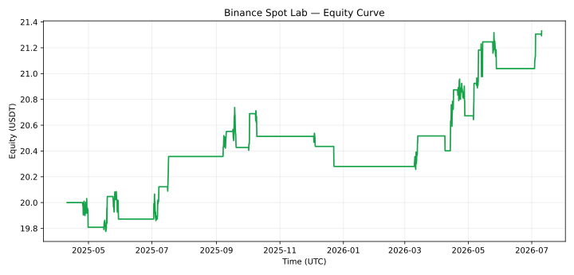

# Evaluasi v0.4: delapan pair, satu akun

**Status: `RESEARCH_FAIL` / `NO_TRADE`. Tidak ada kandidat yang lolos seleksi training.**
Adaptive terlihat lebih baik pada 20 USDT, tetapi merugi pada 1.000 dan 10.000 USDT.
Hasil belum stabil lintas modal. Semua angka di bawah adalah simulasi setelah fee dan
slippage, bukan transaksi Testnet atau live.

## Data dan metode

- Pair: BTCUSDT, ETHUSDT, BNBUSDT, SOLUSDT, XRPUSDT, ADAUSDT, AVAXUSDT, LINKUSDT.
- Candle 4 jam: 4.381 bar per pair, 10 Juli 2024 08:00–10 Juli 2026 08:00 UTC.
- Training: 10 Juli 2024 08:00–10 April 2025 08:00 UTC, batas akhir eksklusif.
- OOS: 10 April 2025 12:00–10 Juli 2026 12:00 UTC, batas akhir eksklusif; embargo satu
  candle, lima window penuh tiga bulan. Parameter dibekukan setelah training.
- Satu saldo bersama dan maksimal satu posisi untuk seluruh pair; saldo, posisi, dan
  peak equity berlanjut antar-window. Fill pada open berikutnya, stop lebih dahulu bila
  stop dan target tersentuh bersamaan, gap stop diisi pada open yang lebih buruk.
- Fee 10 bps dan slippage 5 bps **per sisi**; sizing memakai risk budget, pembulatan lot,
  notional proteksi, serta batas partisipasi volume candle sebelumnya.

CSV berasal dari [snapshot pihak ketiga](https://github.com/Ilnyr2006-droid/python-paper-trading-agent-1-data).
Identitas blob Git dipin di [source_blobs.json](source_blobs.json); SHA-256 CSV aktual
dan asumsi filter lot/tick tercatat di [manifest.json](manifest.json). Data maupun filter
historis **belum diverifikasi independen ke Binance**. Eksperimen memakai minimum notional
asumsi 5 USDT. Karena itu sumber ini tidak dapat membuka gate paper/live.

## Hasil OOS pada modal 20 USDT

| Kandidat | Trade | WR | Profit factor | Return net | Max drawdown | Window positif |
| --- | ---: | ---: | ---: | ---: | ---: | ---: |
| Baseline EMA | 41 | 36,59% | 0,983 | −0,45% | 10,76% | 2/5 |
| Adaptive trend/pullback | 23 | 56,52% | 1,817 | +6,66% | 2,31% | 4/5 |
| Adaptive selective | 5 | 60,00% | 1,928 | +1,77% | 1,36% | 2/5 |

Metrik lengkap termasuk average win/loss, expectancy, biaya, saldo akhir, dan penolakan
sizing ada di [comparison.csv](comparison.csv). Untuk adaptive, average win 0,22778 USDT,
average loss −0,16297 USDT, expectancy 0,05789 USDT/trade, dan saldo akhir 21,33137 USDT.
WR 56,52% hanya berasal dari 23 trade: interval Wilson 95% sekitar **36,81–74,37%**.
WR 60% kandidat selective berasal dari lima trade dan tidak memadai untuk kesimpulan.



Ini kurva satu kandidat diagnostik; kebijakan seleksi sebenarnya tetap menahan kas.
[Trade log adaptive](adaptive/trades.csv), [equity CSV](adaptive/equity.csv), dan
[hasil per window](windows.csv) tersedia untuk audit.

## Sensitivitas modal: kelemahan utama

| Modal awal | Trade adaptive | WR | Profit factor | Return net | Max drawdown | Sizing ditolak |
| --- | ---: | ---: | ---: | ---: | ---: | ---: |
| 20 USDT | 23 | 56,52% | 1,817 | +6,66% | 2,31% | 30 |
| 1.000 USDT | 42 | 35,71% | 0,745 | −5,76% | 7,22% | 0 |
| 10.000 USDT | 42 | 35,71% | 0,744 | −5,77% | 7,22% | 0 |

Pada 20 USDT, banyak order ATR tidak memenuhi notional minimum atau batas sizing.
Ketika modal membesar, order tambahan menjadi layak; adanya satu posisi bersama juga
mengubah urutan peluang yang dapat diambil. Keuntungan pada subset modal kecil bukan
bukti keunggulan yang bertahan pada modal lebih besar. Saldo bot tetap dinamis, tetapi
hasil strategi harus diuji kembali untuk skala modal yang akan digunakan.

[capital_sensitivity.csv](capital_sensitivity.csv) memuat ketiga kandidat pada ketiga
nominal, tanpa memilih pemenang baru dari hasil OOS. Baseline juga negatif pada semua
nominal, dan selective negatif pada 1.000 serta 10.000 USDT.

## Mengapa gate gagal

[training.csv](training.csv) memperlihatkan alasan tidak ada kandidat terpilih:

- Baseline mencapai drawdown 10,44%, melampaui batas 10%.
- Adaptive hanya memiliki delapan trade training, di bawah minimum sepuluh.
- Selective hanya memiliki satu trade training.

Setiap kandidat juga gagal pada verifikasi sumber. Baseline gagal metrik profit,
drawdown, dan konsistensi OOS; selective kekurangan trade OOS dan window positif.
Status serta seluruh alasan disimpan di `validation_summary.json` setiap kandidat.
Parameter tidak dilonggarkan setelah melihat hasil OOS untuk memaksakan kelulusan.

Pada 20 USDT, stress biaya adaptive 1,5× dan 2× masih menghasilkan return +5,40% dan
+4,24%, dengan profit factor 1,794 dan 1,734. Lihat
[cost_sensitivity.csv](adaptive/cost_sensitivity.csv). Hal ini tidak mengatasi kegagalan
training, sumber, atau sensitivitas modal.

## Reproduksi dan langkah berikutnya

Dari root repository setelah instalasi dependencies:

```bash
python scripts/reproduce_multicoin.py --download-snapshot --capital-sensitivity
```

Download memakai blob Git yang dipin dan memeriksa SHA. CSV yang sudah ada tidak
diunduh ulang; hash aktualnya dicatat. Raw data disimpan di `data/snapshots/` dan tidak
ikut commit. Konfigurasi setiap kandidat disertakan untuk audit, dengan status gagal
yang tetap berlaku.

Riset berikutnya memerlukan data publik Binance yang terverifikasi, asumsi filter
yang dicatat, pengujian pada skala modal sasaran, dan periode validasi baru yang belum
dipakai untuk tuning. Universe ini statis sehingga mengandung survivorship bias;
hasil delapan pair tidak mewakili semua listing Binance. OHLCV tidak menyediakan depth,
spread historis, atau jaminan fill stop-limit. Baru setelah bukti riset stabil, jalankan
Testnet minimal 14 hari runtime aktif dan evaluasi trade yang benar-benar tercatat.
