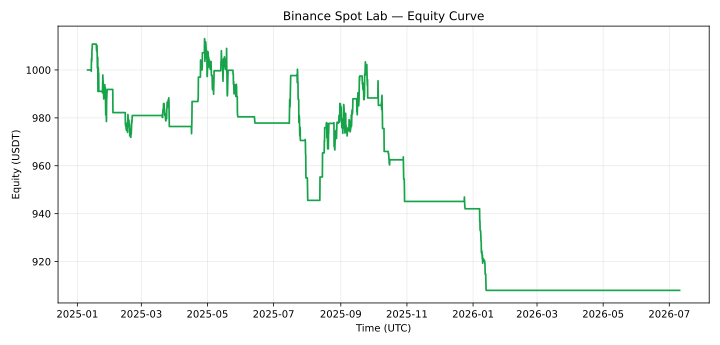

# Evaluasi v0.5 — target WR belum tercapai

**Seluruh kandidat `RESEARCH_FAIL`; seleksi training `NO_TRADE`.** Filter regime/rebound
belum menghasilkan keunggulan yang stabil. Target WR 55%, profit factor ≥1,05,
expectancy positif, dan batas drawdown 10% belum terpenuhi bersama. Tidak ada transaksi
Binance Testnet atau live dalam laporan ini.

## Protokol

- Delapan pair Spot/USDT: BTC, ETH, BNB, SOL, XRP, ADA, AVAX, LINK, candle 4 jam.
- Data: 10 Juli 2023 08:00–10 Juli 2026 08:00 UTC, 6.577 bar per pair.
- Training: 10 Juli 2023 08:00–10 Januari 2025 08:00 UTC, batas akhir eksklusif.
- Evaluasi: 10 Januari 2025 12:00–10 Juli 2026 12:00 UTC, batas akhir eksklusif.
  Embargo satu candle; enam window penuh tiga bulan.
- Enam kandidat ditetapkan sebelum eksekusi batch: baseline, adaptive, reversion trend,
  reversion range, reversion hybrid, dan reversion selective. Tidak dilakukan tuning
  ulang setelah melihat hasil batch ini.
- Setiap kandidat diuji pada 20, 1.000, dan 10.000 USDT. Semua modal harus memenuhi
  syarat training; skor terburuk antar-modal menjadi pembanding seleksi.
- Minimum 20 trade training dan 30 trade evaluasi; target WR 55%. Fee 10 bps dan
  slippage 5 bps per sisi, lalu stress keduanya pada 1,5× dan 2× untuk setiap modal.
- Satu saldo bersama, maksimal satu posisi, risk budget 1%, alokasi maksimal 50%,
  SL/TP wajib, daily stop 3%, max drawdown stop 10%. Peak tidak direset antar-window.

[protocol.json](protocol.json) mencatat konfigurasi dan kandidat;
[manifest.json](manifest.json) memuat identitas data, hasil, dan alasan kegagalan.
CSV pihak ketiga dan asumsi lot/tick berasal dari snapshot yang sama dengan v0.4.
SHA-256 diperiksa, tetapi data serta filter historis **belum diverifikasi ke Binance**.
Periode evaluasi juga telah dipakai dalam penelitian sebelumnya. Hasil ini bersifat
**eksploratif**, bukan fresh holdout atau persetujuan deploy.

## Hasil pada 1.000 USDT

| Kandidat | Trade | WR | Profit factor | Return net | Max drawdown |
| --- | ---: | ---: | ---: | ---: | ---: |
| Baseline | 14 | 14,29% | 0,295 | −8,12% | 10,69% |
| Adaptive | 15 | 20,00% | 0,281 | −7,77% | 10,04% |
| Reversion trend | 45 | 37,78% | 0,623 | −9,33% | 10,66% |
| Reversion range | 32 | 34,38% | 0,783 | −2,98% | 5,93% |
| Reversion hybrid | 60 | 38,33% | 0,708 | −9,20% | 10,37% |
| Reversion selective | 49 | 36,73% | 0,647 | −9,17% | 10,14% |

[comparison.csv](comparison.csv) memuat metrik lengkap, interval Wilson 95%, average
win/loss, expectancy, fee, dan notional skip. Setiap folder kandidat berisi trade log,
equity CSV/SVG, stress biaya, konfigurasi, dan alasan gate gagal.

Angka v0.5 tidak dapat dibandingkan langsung dengan v0.4 karena periode mulai dan
protokol berbeda. Beberapa kandidat mencapai batas drawdown lebih awal lalu dilarang
membuka posisi baru sampai akhir evaluasi. Window setelah penghentian tetap tercatat;
saldo dan peak tidak direset. Gap harga dapat membuat drawdown melampaui ambang stop.

## Semua modal untuk preset hybrid

| Modal | Trade | WR | Profit factor | Return net |
| --- | ---: | ---: | ---: | ---: |
| 20 USDT | 63 | 39,68% | 0,761 | −6,93% |
| 1.000 USDT | 60 | 38,33% | 0,708 | −9,20% |
| 10.000 USDT | 60 | 38,33% | 0,708 | −9,21% |



Hybrid adalah preset demo yang ditentukan sebelum batch, bukan pemenang hasil.
[capital_sensitivity.csv](capital_sensitivity.csv) memuat seluruh 18 kombinasi; semuanya
menghasilkan return net negatif. Trade log dan stress biaya modal selain preset utama
tersimpan dalam subfolder `capital_20/` dan `capital_10000/` tiap kandidat.

## Keputusan

[training.csv](training.csv) menunjukkan baseline sempat menghasilkan return sekitar
+20,8% pada training dengan WR 46,48%, lalu merugi pada periode evaluasi. Ini menunjukkan
mengapa satu periode atau WR sendirian tidak cukup. Kandidat reversion juga belum
memiliki expectancy training positif. Tidak ada yang terpilih; kebijakan seleksi
sebenarnya tetap menahan kas. Kurva kandidat merupakan diagnostik hipotesis.

Gate tetap dikunci. Gunakan demo untuk memeriksa perangkat lunak. Bukti selanjutnya
memerlukan data Binance yang dapat diverifikasi dan periode baru yang belum digunakan
untuk mengembangkan atau memilih strategi, sebelum uji Testnet minimal 14 hari.

## Reproduksi

```bash
python scripts/research_regime.py --download-snapshot --output reports/evaluation-v0_5
# Replay singkat; tidak dihitung sebagai paper:
bash scripts/codespaces-demo.sh
```

Workflow GitHub **Research replay** menjalankan script yang sama dan mengunggah output
sebagai artifact. CI sukses berarti program selesai; status riset gagal tetap berlaku.
